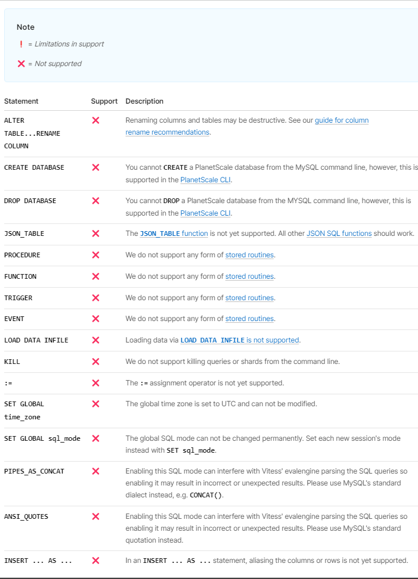
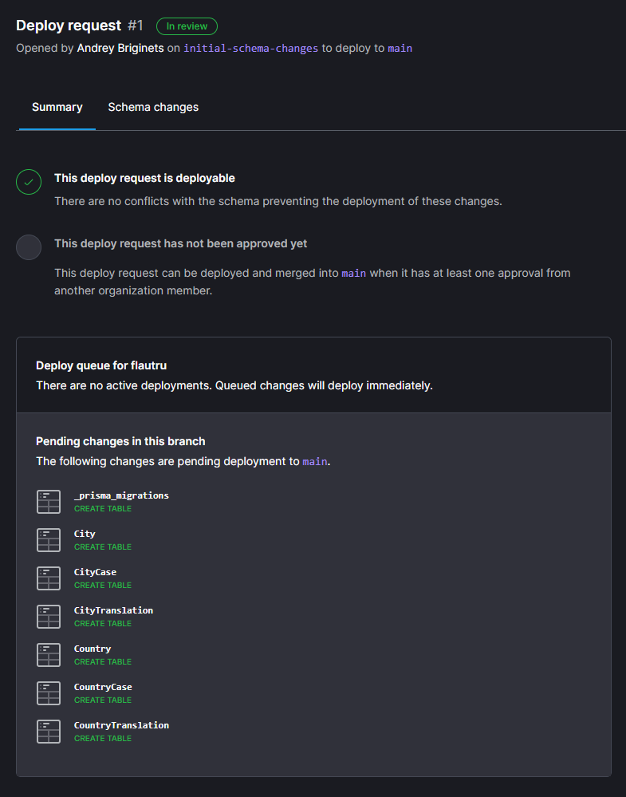
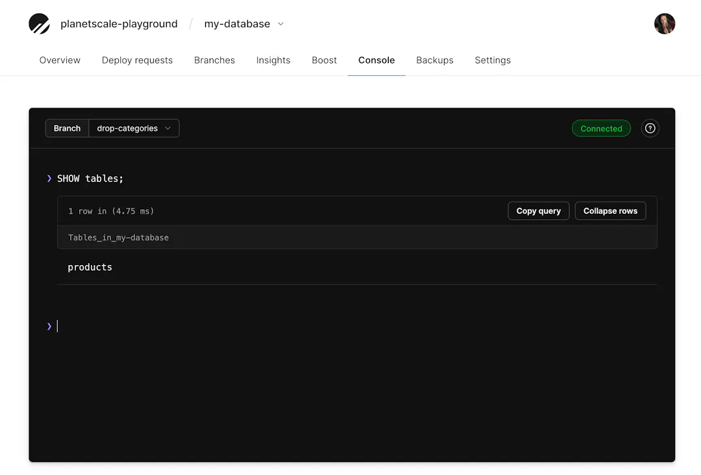
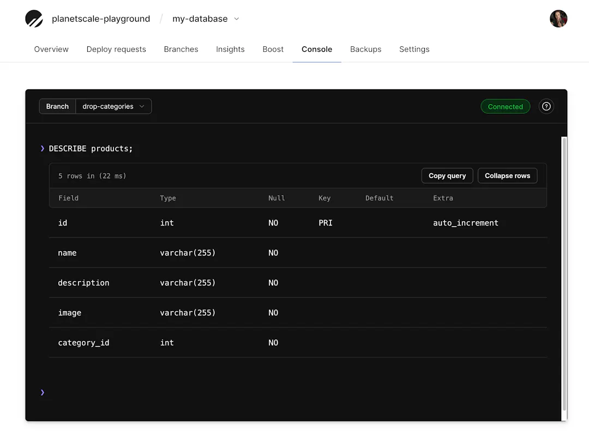
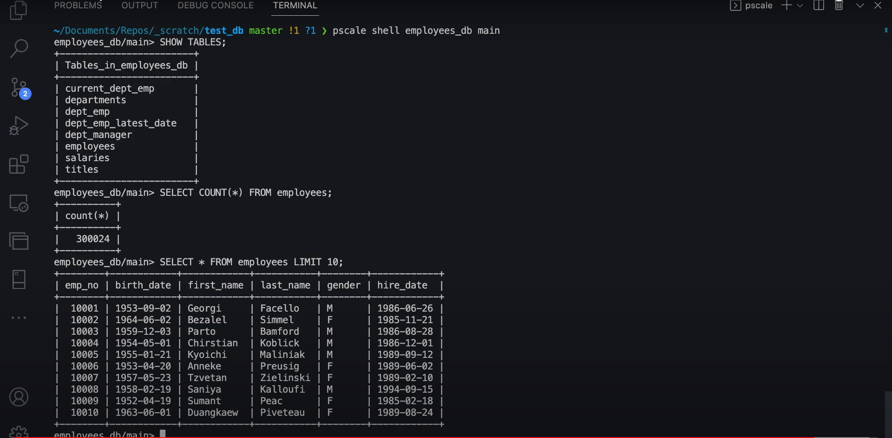
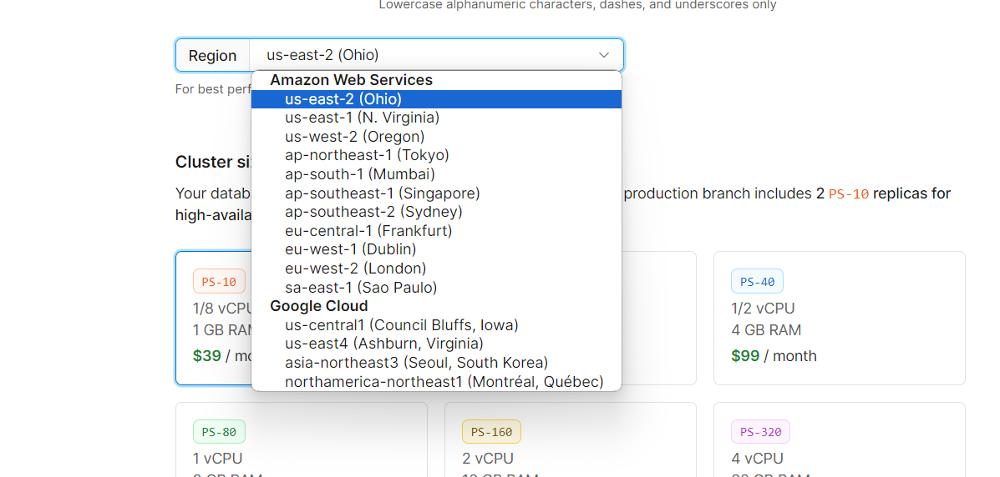
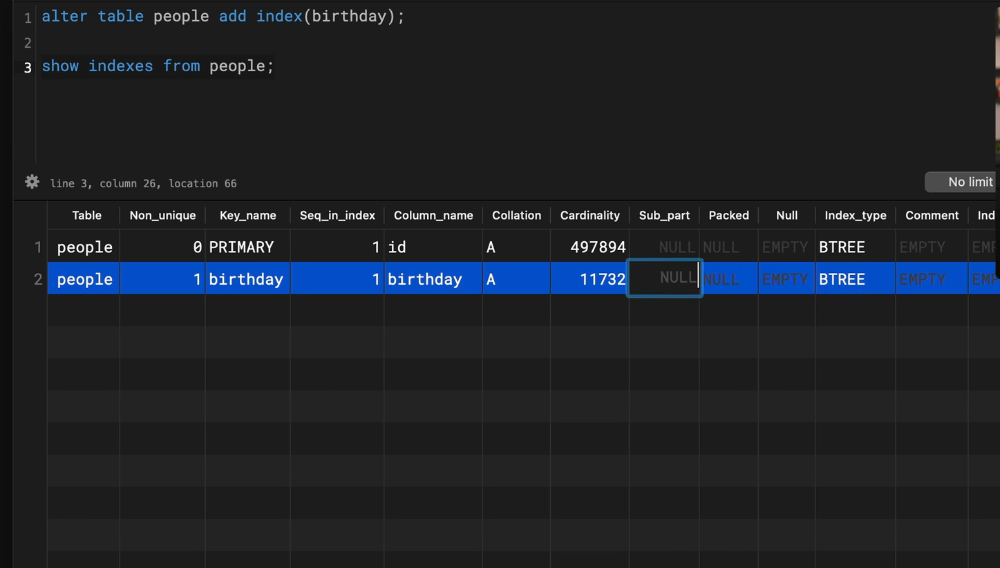
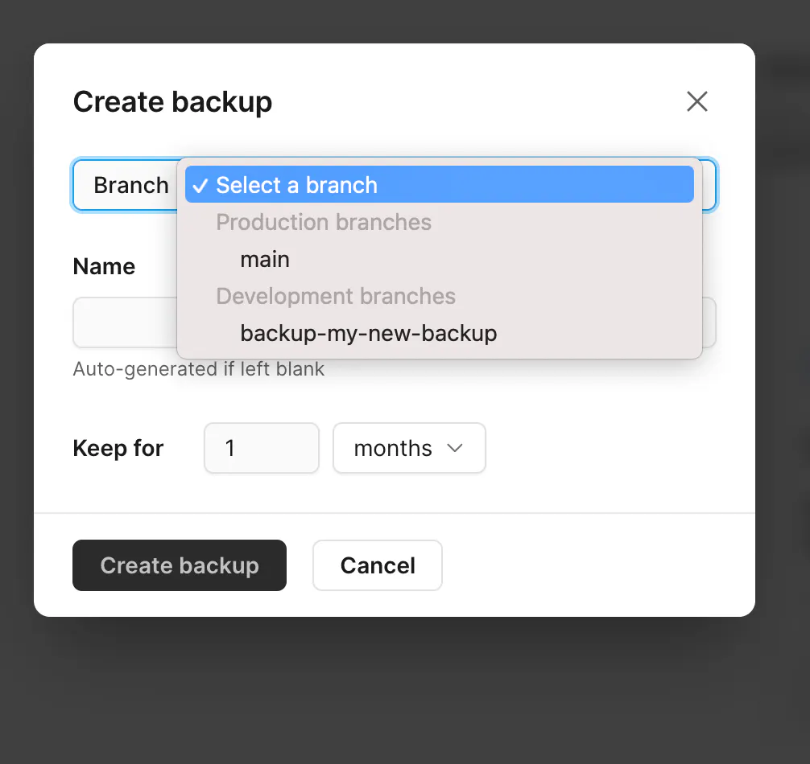
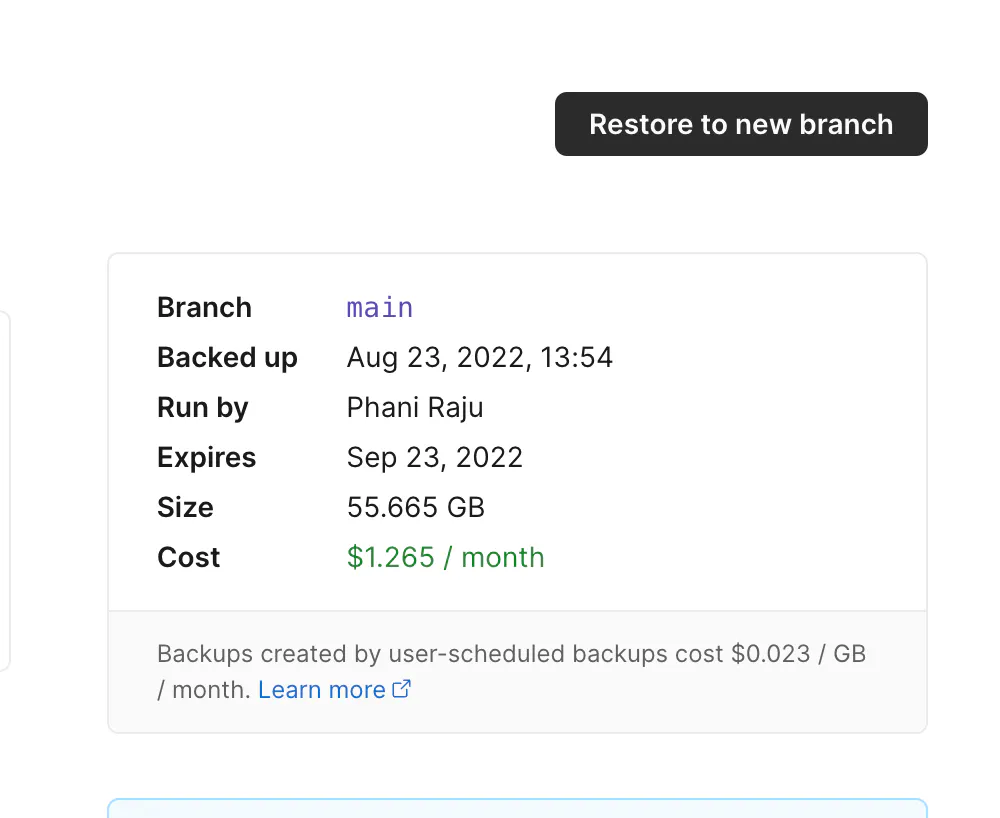

## **СУБД PlanetScale** 

a)

PlanetScale основан на Vitess, технологии баз данных с открытым исходным кодом, внедренная для обслуживания трафика баз данных YouTube в 2010 году. 
Vitess — это решение для баз данных для развертывания, масштабирования и управления большими кластерами экземпляров баз данных с открытым исходным кодом. В настоящее время он поддерживает MySQL и Percona Server для MySQL.  
Он спроектирован так, чтобы работать как в общедоступной или частной облачной архитектуре, так и на выделенном оборудовании. Он сочетает в себе и расширяет многие важные функции SQL с масштабируемостью базы данных NoSQL.  
Vitess решает следующие проблемы:  
  -Масштабирование базы данных SQL за счет возможности сегментирования ее при минимальном внесении изменений в приложение.  
  -Миграция с «голого железа» или виртуальных машин в частное или общедоступное облако.  
  -Развертывание и управление большим количеством экземпляров базы данных SQL.  

Таким образом, Vitess крайне полезная технология, но ее сложно внедрить и поддерживать без большой команды. Один из создателей Vitess хотел сделать его доступным для всех, поэтому позже он стал соучредителем PlanetScale. 
Благодаря PlanetScale каждая база данных, которую создается, получает под капот Vitess, что позволяет разработчикам создавать масштабируемые и надежные приложения, основанные на MySQL, 
без необходимости беспокоиться о сложностях управления инфраструктурой базы данных.  

Компания быстро привлекла внимание инвесторов благодаря своему потенциалу изменить способ, которым компании масштабируют свои базы данных. 
Серия раундов финансирования позволила PlanetScale расширить свои возможности и увеличить свою клиентскую базу.  

Сегодня PlanetScale является одним из ведущих поставщиков облачных баз данных, специализирующихся на масштабируемых MySQL. Их технология Vitess широко используется в индустрии и признана за свою эффективность и надежность.
С момента запуска общедоступной версии в ноябре 2021 года PlanetScale быстро выросла как по функциям, так и по количеству клиентов.

b)
  1) [PlanetScale Console](https://planetscale.com/docs/concepts/web-console):
     Это веб-интерфейс, предоставляющий администраторам и разработчикам возможность управлять и мониторить базы данных.
     Здесь можно создавать и настраивать базы данных, просматривать статистику использования ресурсов, управлять доступом и т. д.

  2) [PlanetScale CLI](https://planetscale.com/docs/reference/planetscale-cli):
     Это инструмент командной строки, который предоставляет аналогичные возможности, как и веб-консоль, но через командную строку.
     Это удобно для автоматизации задач и интеграции с другими инструментами разработки.

  3) PlanetScale Connect:
     С помощью [PlanetScale Connect](https://planetscale.com/docs/integrations/airbyte) можно извлекать данные из своей базы данных PlanetScale и безопасно загружать их в другие места для анализа, преобразования и многого другого.
     Используется коннектор Airbyte в качестве конвейера между источником PlanetScale и выбранным пунктом назначения. 

  4) API:
     PlanetScale также предоставляет [API](https://api-docs.planetscale.com/reference/getting-started-with-planetscale-api) для автоматизации управления базами данных. API полезен для интеграции PlanetScale в другие инструменты разработчика для ускорения рабочих процессов разработки.
     Например, можно программно создавать и удалять ветки базы данных, открывать и объединять запросы на развертывание и многое другое.

c)

На движке MySQL 8.
Так же при подгрузке уже существующих БД PlanetScale поддерживает MySQL версий начиная с 5.7.
При этом в PlanetScale присутствует ряд ограничений для запросов, функций и синтаксиса MySQL. Они отражены в таблице ниже.

d)

Система взаимодействия с БД похожа на git: есть много веток dev, в каждой из которых может содержаться какая-то версия БД (по умолчанию только схема), если мы хотим применить эти изменения нужно создать deploy request в prod ветку, после чего внесенные изменения будут применены. 

Таким образом запросы производятся в выбранной ветке. Так как БД платная и самому потестить ее не получилось, прикладываю пару скринов из документации, тут запросы осуществляются из веб-интерфейса.  
  
  
И еще из гайдa: здесь к БД подключаются из терминала и выбирают ветку в которой будут работать. Отмечу, что некоторые запросы нельзя выполнить в терминале MySQL, например create и drop, только с помощью средств PlanetScale (см b).
  

e)

PlanetScale является Serverless СУБД, соответственно вся серверная архитектура обеспечивается компанией и разработчику не нужно самому ее организовывать: в данном случае это сервера Amazon Web Services и Google Cloud. БД общим размером до 10гб можно хранить бесплатно (однако все равно придется платить за операционные мощности кластера), больше - +1.5$ за гб.

f)

На каких языках написана СУБД несложно узнать из [репозитория](https://github.com/planetscale?language=go) проекта: как и vitess, лежащий в основе, написан на go, так и остальные модули planetscale.  

g)

Поддерживаются все типы индексов MySQL.  
  1) Обычный индекс  
  2) Префикс-индекс (первые несколько элементов строки)  
  3) Составной индекс  
  4) Функциональный индекс (индексируемые элементы задаются функцией)  
  5) FULLTEXT индекс  

Создание индекса:  
  

h)

1) Маршрутизация и сегментирование. В PlanetScale данные горизонтально секционируются или сегментируются по нескольким экземплярам MySQL. Каждый сегмент содержит подмножество данных на основе ключа сегментирования. При получении запроса уровень маршрутизации определяет, какой сегмент или сегменты содержат соответствующие данные для этого запроса, на основе ключа сегментирования, указанного в запросе. Это гарантирует, что запрос будет направлен только к необходимым сегментам, сокращая ненужное перемещение данных.  
2) Параллельное выполнение запроса. Как только уровень маршрутизации определит сегменты, участвующие в запросе, запрос может выполняться параллельно между этими сегментами.  
3) Координация запросов. Несмотря на то, что запросы выполняются параллельно в разных сегментах, по-прежнему существует необходимость координации для обеспечения правильности и согласованности результатов. Координатор запросов PlanetScale контролирует выполнение распределенных запросов, организует связь между сегментами, агрегирует промежуточные результаты и выполняет любую необходимую сортировку или объединение данных из разных сегментов.  
4) Распределенные объединения и агрегаты. В тех случаях, когда запросы включают объединения или агрегаты, охватывающие несколько сегментов, механизм выполнения запросов PlanetScale разумно распределяет вычисления по сегментам. Это может включать в себя удаление предикатов для минимизации перемещения данных, выполнение частичной агрегации отдельных сегментов, а затем объединение результатов на уровне координатора.  

i)

План выполнения состоит из операторов, каждый из которых выполняет определенную часть работы. Операторы объединяются в древовидную структуру, которая представляет собой общий план выполнения. План представляет каждого оператора как узел дерева. Каждый оператор принимает на вход ноль или более строк и выдает на выходе ноль или более строк. Это означает, что выходные данные одного оператора становятся входными данными для следующего оператора. Операторы, соединяющие две ветви дерева, объединяют входные данные двух входящих потоков и создают один выходной сигнал.  

Оценка плана выполнения начинается с конечных узлов дерева. Листовые узлы получают данные из службы топологии, а в некоторых случаях также могут локально оценивать значения выражений. Каждый листовой узел не будет получать входные данные от других операторов и будет передавать любые узлы, которые они создают, в свои родительские узлы. Родительские узлы затем будут передавать узлы своим родительским узлам вплоть до корневого узла. Корневой узел выдает окончательные результаты запроса и доставляет их пользователю.  

j)

1) Распределенные транзакции:  
PlanetScale поддерживает распределенные транзакции по шардам. Для поддержания свойства ACID в распределенной транзакции PlanetScale использует 2PC. На первом этапе координатор транзакций просит каждый шард подготовиться к фиксации. Если все шарды согласны совершить транзакцию, координатор переходит ко второму этапу, где он дает указание каждому шарду завершить транзакцию. Если какой-либо сегмент не может подготовиться или завершиться, вся транзакция откатывается.  
 
2) Локальные транзакции:  
В тех случаях, когда транзакции включают только один сегмент, используются локальные транзакции.  

С точки зрения приложения PlanetScale обеспечивает семантику транзакций, аналогичную семантике традиционных реляционных баз данных, позволяя использовать стандартные конструкции транзакций SQL без каких либо ограничений.

k)

Можно бэкапить и восстанавливать ветки:  
  
  
Хранение бэкапов оплачивается ежемесячно, так же в случае приобретения расширенной подписки ветки будут бэкапится автоматически. Можно настроить частоту бэкапов и длительность хранения версий. Благодаря концепции версионности процесс сохранения и восстановления достаточно прост в реализации и осуществляется через веб-интерфейс.  
Важно отметить, что в самих ветках по сути хранятся только схемы, без данных, поэтому их можно создавать сколько угодно бесплатно. Функция бэкапа позволяет сохранять и восстанавливать таблицы с измененными данными.  

l)

Шардирование:  
Применяется горизонтальное шардирование. PlanetScale позволяет разбить монолитную БД и распределить данные по нескольким БД, при этом логика сегментирования исключается из приложения, то есть с точки зрения приложения существует только одна база данных с которой происходит взаимодействие через инструменты PlanetScale.  

Принцип работы:  
PlanetScale использует явную систему сегментирования, то есть согласует с Vitess, какая стратегия сегментирования будет использоваться для каждой таблицы. После обозначения стратегий определяется ключ сегментирования, управляющий тем, как значение столбца сопоставляется с идентификатором пространства ключей. Каждый сегмент будет охватывать диапазон значений идентификатора пространства ключей, поэтому это сопоставление используется для определения того, в каком сегменте находится строка. Для определения этого ключа необходимо предоставить команде PlanetScale следующую информацию:  
  - Копия схемы.  
  - Размеры каждой таблицы в базе данных.  
  - Информация об общих шаблонах запросов — обычно это 50–100 наиболее часто используемых запросов.  

В ходе этого анализа этих данных сотрудники PlanetScale определяют кандидата на роль ключа сегментирования, а также какие таблицы следует сегментировать, потребуются ли вторичные ключи сегментирования, стратегию для таблиц, которые не содержат выбранный ключ.  

m)

1) Data Mining  
  Каких-то специализированных инструментов для этих целей нет.  
2) Data Warehousing  
  Учитывая простоту скалирования, думаю PlanetScale вполне можно использовать в качестве централизованного хранения данных.  
3) OLAP  
  Присутсвует OLAP-мод, для активации необходимо прописать команду "SET workload = OLAP". В этом режиме запросы могут возвращать более 100к строк, однако на обновление и удаление снятие ограничения не распространяется.  

n)

1) Шифрование данных:  
Базы данных PlanetScale и их клиентские коммуникации шифруются по алгоритму AES на всей платформе PlanetScale.

При хранении:
Данные шифруются на базовом носителе, который обслуживает ветви базы данных, а также на базовом носителе, на котором хранятся резервные копии базы данных PlanetScale.

При передаче:  
  - PlanetScale CLI использует TLS при инициировании соединения с API PlanetScale и Edge.  
  - [Connection strings](https://planetscale.com/docs/concepts/connection-strings) PlanetScale требуют успешного установления сеанса TLS, прежде чем можно будет выполнить какие-либо команды SQL.  
  - TLS используется для защиты всех данных, передаваемых между PlanetScale и клиентами с помощью PlanetScale Connect.  
2) Конфеденциальность:  
На все планы PlanetScale распространяется наше дополнение к [Data Progressing (DPA)](https://planetscale.com/legal/data-processing-addendum).
3) Локализация данных:  
Инфраструктура, поддерживающая пользовательские базы данных, резервное копирование и. т. п., находятся у провайдера (AWS или GCP) на серверах в регионе, где создается база данных. Любые read-only реплики в других географических регионах будут копировать набор данных в выбранные регионы.
4) Аутентификация:
В качестве особенности аунтификации выделю [Service tokens](https://planetscale.com/docs/concepts/service-tokens). Если говорить коротко - фича позволяет создавать токены дающие доступ к базе данных с определенными правами и ограничениями. Это достаточно удобно в силу git-подобной организации процесса взаимодействия с БД в PlanetScale. Кроме того их удобно встраивать в API, тем самым уменьшая уязвимость приложения. 

o)

Все [контрибьюторы](https://github.com/orgs/planetscale/people) являются сотрудниками PlanetScale. Так же СУБД продвигается в комьюнити Vitess, что довольно логично так как часть разработчиков ранее работало там и сама PlanetScale является развитием Vitess, сделав его доступным для массового пользователя. Относительно свежий [пост](https://vitess.io/blog/2024-04-08-vitess-fuzzing-summer-2023-internship/). 

p)

Подойдет небольшая [MySQL БД](https://www.mysqltutorial.org/getting-started-with-mysql/mysql-sample-database/). Она используется в MySQL tutorial, поэтому подойдет для тестирования в нашей СУБД.

q)

Присутствует функция [импорта базы данных](https://planetscale.com/docs/imports/database-imports).  
Для этого можно создать свою MySQL БД и загрузить туда данные из p) в облачном сервисе (например Amazon AWS) или взять чью-то существующую, настроить подключение по ssl и импортировать ее в PlanetScale. (причем импортировать можно не только MySQL БД, но и MariaDB) После этого можно создать отдельную ветку, чтобы изменения не отражались на исходной БД и эксперементировать там с запросами.

r)

[Документация](https://planetscale.com/docs): здесь кратко описаны различные фичи СУБД  
[Обучение](https://planetscale.com/resources): 3 базовых курса - по скалированию БД на примере vitess, по MySQL на котором работает PlanetScale и по интеграции с питоновскими приложениями.  
Видео из этих курсов так же выложены на youtube и довольно легко находятся по запросам вроде "planetscale tutorial"  

s)

[Блог](https://planetscale.com/blog): основной источник  
[Твиттер](https://twitter.com/PlanetScale?ref_src=twsrc%5Egoogle%7Ctwcamp%5Eserp%7Ctwgr%5Eauthor): по-сути то же самое что блог, но блог
проще смотреть т к там новости распределены по категориям  
[Discord](https://discord.com/channels/1134636291691126885/1152671370380050533): здесь можно что-то спросить у разработчиков  
